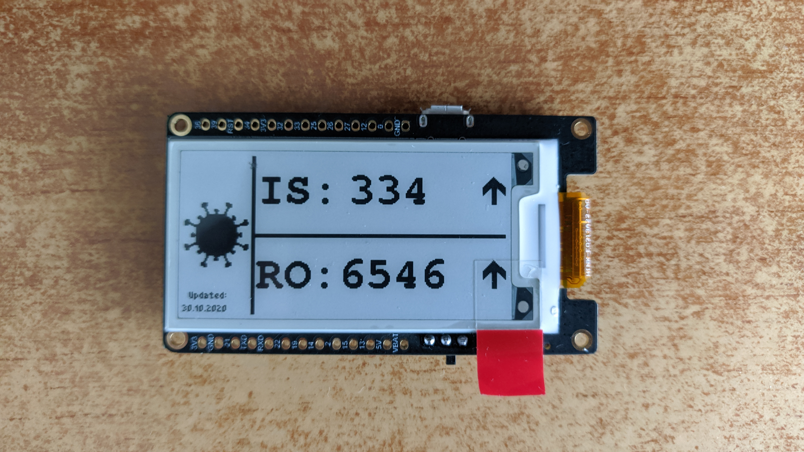

# Corona-Monitor

This is a quick project made to test the TTGO T5 V2.3 ESP32 developer board and using classes in an embedded project (instead of C structures).
It is made using platformio and the arduino core.

*To do:*   
		*-add RTC with alarm function to wake up via interrupt*     
		*-add pullup resistor to the flash chip to enable the flash low power mode(dev board design problem)*    
		*-change the arduino core to the espressif IOT Development framework*    
		*-add more panels switchable by button pressing(Ex:corona panel, regular picture panel etc.)*   

